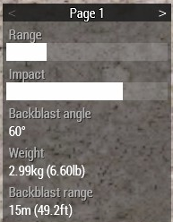

# Light Anti-Tank

## Role Description

An LAT rifleman is a specialized operator class, and is not considered a standard operator.

The primary role of the LAT rifleman is to eliminate light vehicle threats.

### Equipment

- M72

## Usage

### Backblast

Every rocket has a blackblast zone behind the launcher. This area needs to be clear before discharging an LAT weapon. You can see the backblast angle and range in the ACE arsenal stats.

The area needs to be clear of any people or large obstructions. Do not fire the weapon while against a wall or other structure that will redirect the overpressured air back towards you.

Backblast also precludes you from firing the weapon indoors. There needs to be significant open and clear area inside of a structure for you to consider firing from there (such as big and high warehouse)

### Callouts

When you begin to prepare the weapon you must make a callout of "Clear Backblast - [Direction]". The direction should be the direction the rocket will be moving toward. Hold until you hear "Clear Clear Clear" or "Backblast Clear". Once ready call "Rocket out" or "Rocket Rocket Rocket" then discharge the weapon. If you will not be discharging the weapon yell "Cancel Cancel Cancel".

These callouts will greatly reduce the chance of injury to either yourself, or your team members.

Examples

> *LAT*: Clear back - East  
> *Rifleman*: Clear Clear Clear  
> *LAT*: Rocket out

> *LAT*: Clear back - North West  
> *Rifleman*: Clear Clear Clear  
> *LAT*: Cancel Cancel Cancel, vehicle moved away

> *LAT*: Clear backblast  
> *Rifleman*: Backblast Area Clear  
> *LAT*: On the way

When backblast area is not clear

> *LAT*: Clear backblast  
> *Rifleman*: Hold Fire Hold Fire  
> *LAT*: Cancel Cancel Cancel

### M72 LAW (Light Anti-tank Weapon)

The M72 LAW is a disposable (single use) anti-tank rocket launcher. Its designed to be very light and portable (in ready to fire condition its lighter then other empty launchers). It has a primitive iron sights without adjustments and is thus limited to close range engagements. Due to its expendable nature the tube is automatically ejected from inventory after firing.

## Certification

### Theoretical Exam

The trainee should be able to explain the process of firing Anti-Tank weapons.

The trainee should be able to explain target selection for LAT operators.

### Practical Exam

The trainee will need to engage the following string of targets with:

M72 LAW
- Car   - 150m
- Truck - 200m

