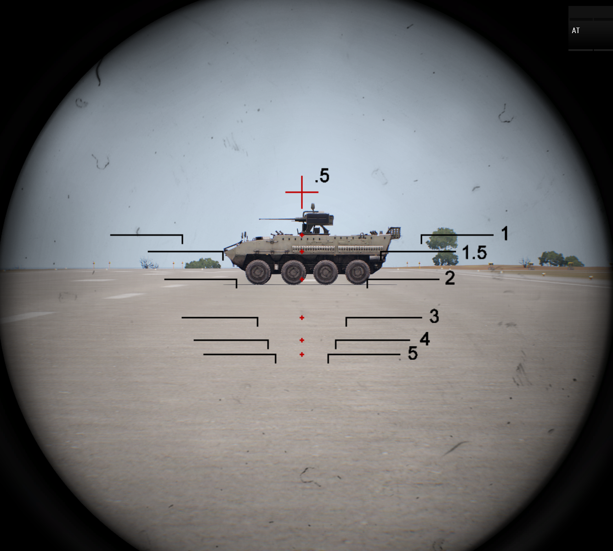

# Medium Anti-Tank

## Role Description

An MAT rifleman is a specialized operator class, and is not considered a standard operator.

The primary role of the MAT rifleman is to eliminate medium and large vehicle threats and provide direct fire anti-personnel and anti-structure fires.

### Specialized Equipment

Completing the certification for MAT Rifleman will unlock the ability to operate MAT weapons. The standard MAT weapons are the RPG-32, PSRL-1 and MAAWS Mk4 Mod 1.

## Usage

### RPG-32

#### Rocket Selection

The RPG-32 has two selections for rockets. The first selection is a High Explosive round. This round is ideal for soft targets, and unarmored vehicles, such as technicals. The second round is a multi-purpose HEAT round equipped with a shaped-charge penetrator and fragmentation sleeve. This round can be used in reduced capacity against infantry and is useful against lightly armored threats, such as up-armored civilian vehicles, and can pose a threat against more heavily armored vehicles if hit in a lightly armored spot, or with enough rounds.

Even though the RPG-32 has an Anti-Tank round, it SHOULD NOT be relied upon to deal with heavily armored threats, instead, a heavier weapon or a HAT operator should be called in to neutralize the threat, depending on severity and availabilty of operators.

#### RPG-32 Ranging Optic

The RPG-32 is equipped with an optic system designed to quickly estimate the range of the threat the operator is shooting at. Be advised that this system is designed for larger vehicles such as APC's and tanks, and will not provide accurate results against civilian vehicles such as trucks and jeeps.

To begin, equip your RPG, and acquire the target in the sight. To estimate range, see which ranging hash most closely fits the vehicle as shown below.

Vehicles may vary in size, so the ranging hashes may be slightly off, but this method should be reliable within acceptable limits.

!> Military vehicles are often close to half as wide as they are long (especially tracked ones), so half of the scale can be use for ranging vehicles front on.

When ranging technicals, the size of the vehicle is smaller than the threat the ranging hashes are designed for. As you can see below, the technical will fit within the 200 meter hashes, but the technical is only 150 meters away. If time permits while engaging these targets, best practice is to ask someone for a range to target before engaging.

### Ranging

All three launchers have the ability to range targets. This is done by pressing the <kbd>T</kbd> while aiming down the sights.

### PSRL-1

#### Rocket Selection

The PSRL-1 also has several rocket variations available for use by MAT operators. Care should be taken while selecting rockets that the correct rocket is being utilized to neutralize the threat. All rockets have a safety fuze of 900m.

Even though the PSRL-1 has several Anti-Tank rocket options, it SHOULD NOT be relied upon to deal with heavily armored threats, instead, heavier HEAT warheads of MAAWS or a HAT operator should be called in to neutralize the threat, depending on severity and availabilty of operators.

#### PSRL-1 PWS Fire Control Optic

The PSRL-1 PWS is the preferred variant of the PSRL-1 due to the ranging optic on the weapon. The PWS variant optic is equipped with a laser rangefinder integrated into the optic. To utilize the laser rangefinder, place the target under the center mark, and press the "Lase Range" button (default "T"). The range will be displayed to the right of the ranging mark. Once a range is determined, the operator will align the target with the proper ranging hash, and can then begin the firing process.

Alternative to the fire control optic is to use short range sight mounted on the base version of PSRL-1 (like unmaginfied red dot or holographic sight). Such sights are not adjustable for drop and zero and must be practiced and learned by a skilled operator. Such usage while not recommended allows an operator to have better situational awareness.

### MAAWS (Multi-Role Anti-Armor Anti-Personnel Weapon System) Mk4 Mod 1

The MAAWS provides a high rate of fire and the ability to fire up to 1,000 meters. It is the primary MAT weapon.

!> The MAAWS has significant backblast. Do not fire the weapon while against a wall or other structure that will redirect the overpressured air back towards you. Exercise caution when firing the weapon.

The MAAWS Mk4 Mod 1 has three different types of projectiles:

**HE 44**: High Explosive 44, use against lightly armored vehicles and bunkers.

**HEAT 55**: High Explosive Anti-Tank 55, use against medium armored vehicles.

**HEAT 75**: High Explosive Anti-Tank 75, use against medium to heavily armored vehicles.

### Buddy loading

All multi-use launchers in Arma 3 can be used as two-man team with gunner and loader. This can increase rate of fire and target acquisition speed. The gunner can focus on looking for targets through the sight while the launcher is operated by the loader

This can be done by loader operator having compatible rounds in their inventory. Loader should stand on the right side of gunner looking towards the backblast area and then using ace interact on the gunner's empty launcher. Loader should take primary the responsibility for clearing backblast.

Load and Fire Procedure

> *Gunner*: Load HEAT  
> *Loader*: Loading!  
> *Loader*: Up!  
> *Gunner*: Clear backblast  
> *Loader*: Backblast Area Clear  
> *Gunner*: On the way

## Certification

### Theoretical Exam

The trainee should be able to explain the difference between rocket variations (such as HE, AT, HEAT, and Frag), and when to utilize specific rocket types.

### Practical Exam

#### Equipment

- RPG-32
- PSRL-1 PWS
- MAAWS Mk4 Mod 1

#### Round 1

RPG-32
- Car   - 150m
- Truck - 200m
- Car   - 250m
- Car   - 350m
- Truck - 400m

#### Round 2

PSRL-1 PWS

- Car   - 150m
- Truck - 200m
- Car   - 250m
- Car   - 350m
- Truck - 400m

#### Round 3

MAAWS Mk4 Mod 1

- Truck     - 400m
- Technical - 860m
- Tank      - 960m

