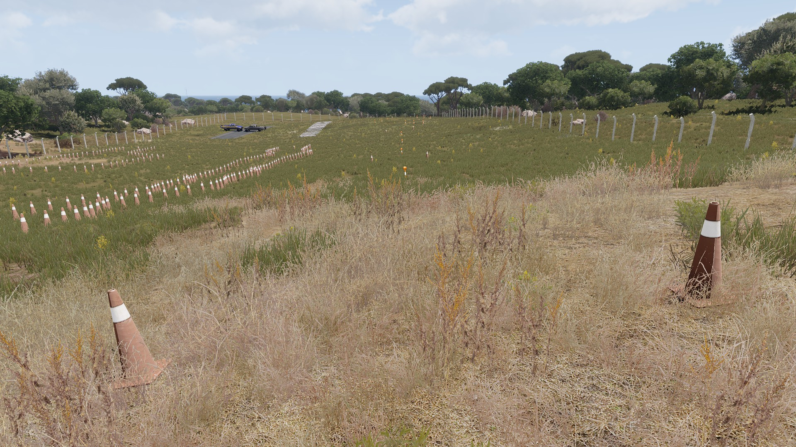
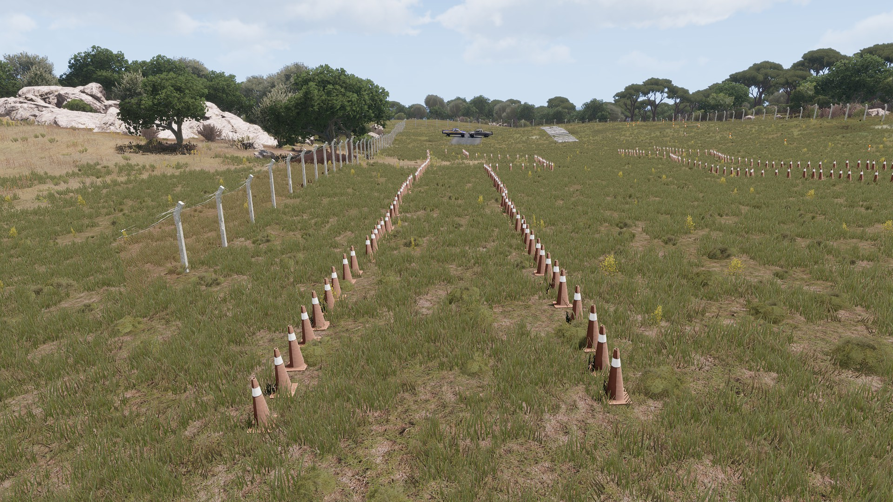
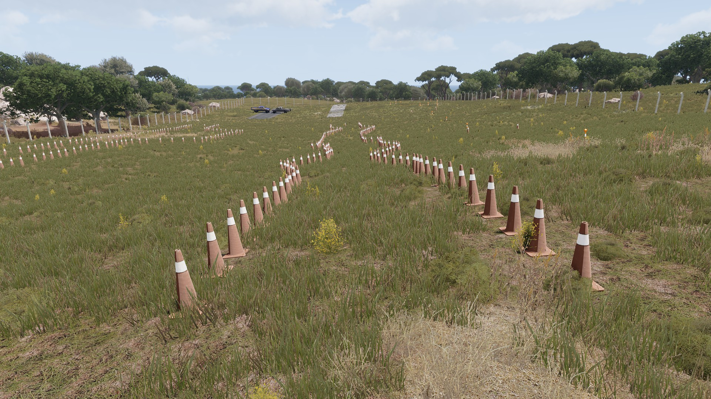
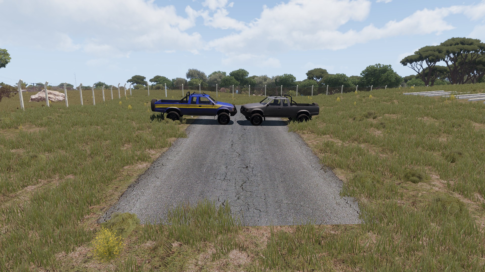
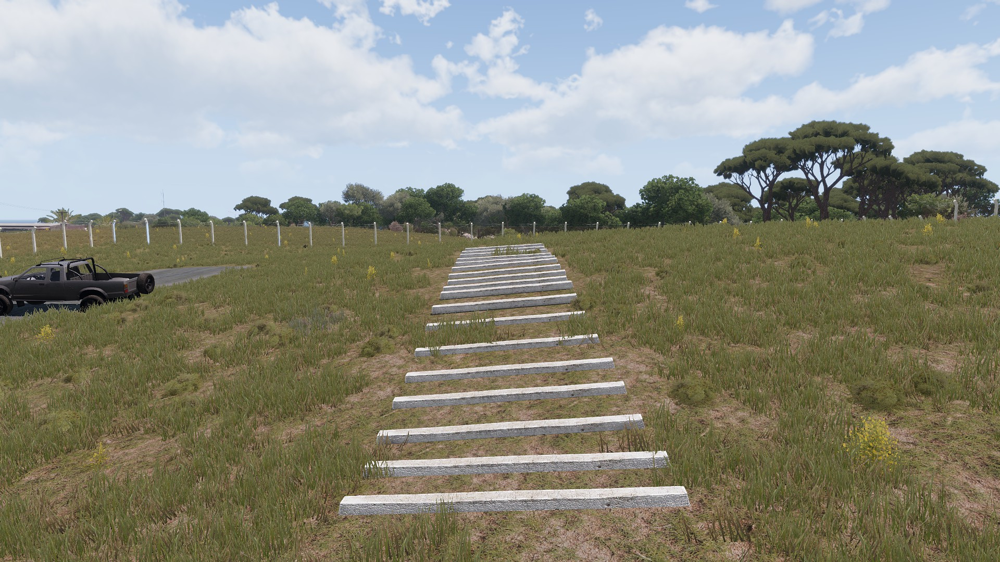

# Tactical Driving

## Role description

Tactical Driving (also known as Defensive Driving) is the practice of anticipating and adapting to dangerous conditions or the mistakes of others while operating a motor vehicle. This can be achieved by following a series of guidelines, for example keeping a two to three second gap between your vehicle and the vehicle in front so that you have enough space to adequately stop.

### General principles of Tactical Driving

- In general
    - Controlling your speed
    - Looking ahead and being prepared for unexpected events
    - Being alert and distraction free
- Regarding other participants in traffic
    - Preparedness for all sorts of actions and reactions of other drivers and pedestrians
    - Not expecting the other drivers to do what you ordinarily do
    - Watching and respecting other drivers
- Regarding your own vehicle
    - Maintaining a safe following distance
    - Driving safely considering weather and/or road conditions
    - Adjusting your speed before entering a bend, in order to avoid applying the breaks in the middle of a bend.

## Equipment

In the driving range contractors will have access to the vehicles that are usually used by Synixe. These include: An Arcadian, a Jeep, a Hilux and Range Rovers which are widely available in the training compound.

They will also have access to first aid kit in order to heal themselves should they get hurt.

## Driving range and maneuver explanation

### Swerve to avoid

The swerve to avoid maneuver is used to quickly dodge an obstacle in the middle of the road. For example a crate that has fallen of a truck or a vehicle blocking the road.

#### Swerve maneuver in the driving range

In this range contractors must pass between the green cones, while avoiding the cones with the light on top.
While traversing this range contractors must focus on keeping a maneuverable speed and not oversteering the vehcile.

### J-Turn

A J-turn is a technique used to quickly turn the car around 180 degrees. This technique is extremely useful when contractors encounter a full frontal block while driving.

#### J-turn in the driving range.

Contractors have to go forward until they cannot advance. They then should bring the car to a stop, reverse and turn the car around in the space they have to the right. They then must start moving forward and keep turning should they need to do so.

### Reverse

When contracotrs are unable to perform a J-turn due to a lack of space, they can instead opt for driving in reverse. The main difference between both maneuvers is that when going in reverse a car is much more difficult to control and brake.

#### Reverse in the driving range

Contractors have to go forward until they cannot longer advance. They then must reverse the vehicle while avoiding crashing with the cones. In order to successfuly do this they must maintain a speed at which the vehicle is maneuverable.

### Ramming

Should contractors encounter a road block and decide that it's the best course of action they can ram said roadblock in order to keep moving forward.

#### Ramming in the driving range

When deciding to ram a roadblock contractors must first be aware of the vehicle they're using. If they attempt to ram the roadblock with a vehicle that is to light the vehicle will just come to a stop in contact with the roadblock.

Once contractors decide they're going to perform a ramming maneuver they should maintain a speed around 60 km/h. If they go to slow they simply will not power through and if they go to fast they will just cause a car crash.

Once the speed is set contractors must aim for the space between the wheel and the car bumper. It can be either front or back. These are the spots in which it will be easier to move a car aside. If contractors crash into the space between the wheel they risk either not moving the car or rolling it and continue to remain blocked. Note that it is easier to push through when aiming for the back bumper because the car is lighter in that area.

Once contractors perform the maneuver in the driving range they can reset the vehicle to their original position using the laptop in the observation platform.

### Car control

When going over low obstacles different vehicles will behave in different ways. While going over contractors must retain control of the vehicle in order to avoid crashes.

#### Car control in the driving range

In the driving range contractors can go over the pieces of concrete in the ground in order to familiarize themselves with how different vehicles will handle going over small objects.
