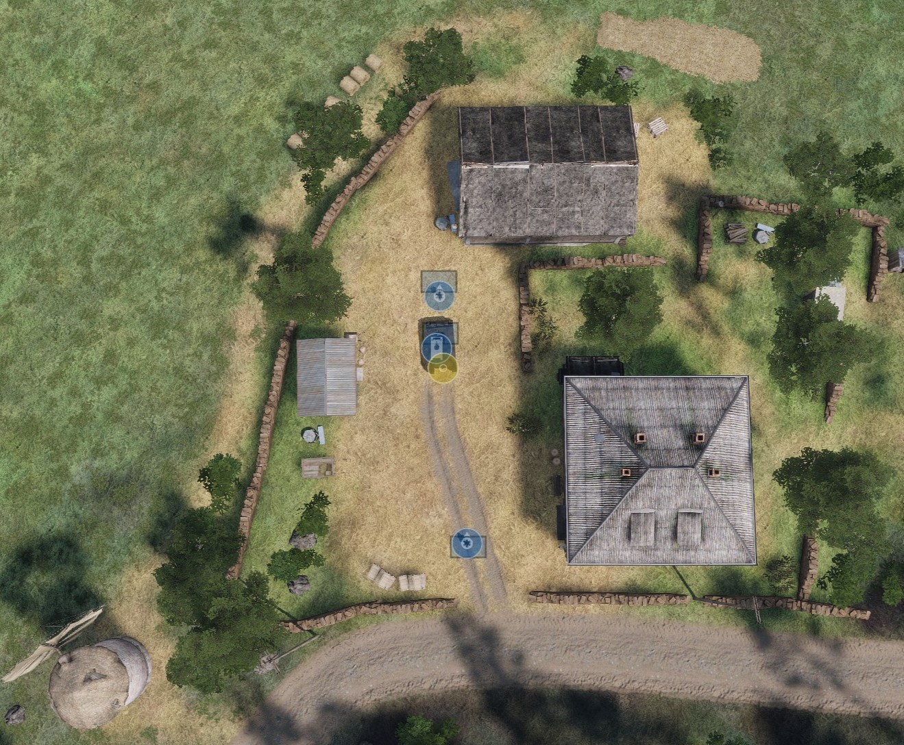
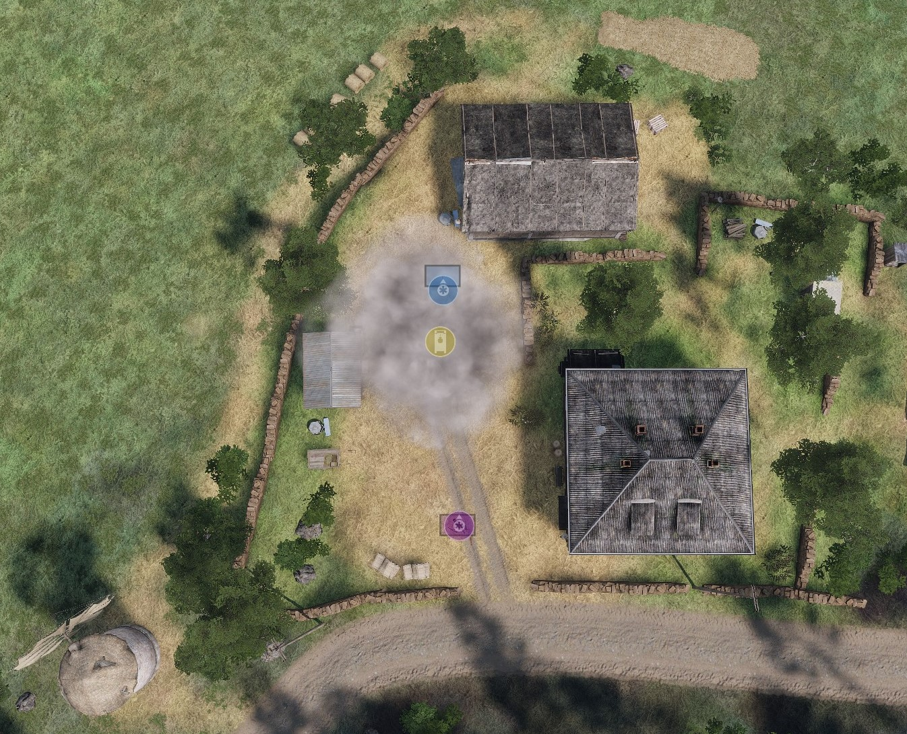

# Engineering - Explosives

## Equipment

**M112 Demolition Block**: A block of explosives used to destroy obstacles and buildings.

**M183 Demolition Charge Assembly**: Sometimes referred to as a "satchel charge", this is a moderate explosive charged used on buildings and armoured vehicles.

**M18A1 Claymore Mine**: A directional explosive mine used to clear out enemy infantry.

!> Synixe Contractors strictly prohibits the use of explosives that may unintentionally cause harm. Explosives that are activiated without the involvement of an operator, such as by pressure, proximity or tripwire, are strictly prohibited.

## Placing Explosives

Always pick the right explosive for the job, when unsure, error on the side of caution and use a smaller explosive.

### Accounting for Air Movement

When planting explosives in the open, always account for the air movements that will result from the explosion. This is especially important when planting explosives near buildings, vehicles, or people. We want to limit damage to civilian structures whenever possible. Target vehicles should be driven / towed away from structures whenever possible.

**Example**: The vehicle blocks most of the damage from travelling north past the vehicle, while the space south of the vehicle takes the full brunt of the explosion. The nearby building takes some damage from the explosion.

Trenches can be dug to help direct the blast up and away from nearby structures. As well as absorbing some of the blast energy.

### Placement on the Target

#### Vehicles

When planting an explosive on a vehicle, it is preferred to place the explosive on top, as that will send most of the unwanted air pressure up and away from unintended targets. When planting on an armoured target, the least armoured sides are preferred. *Never plant an explosive on the bottom of a vehicle.* This can result in the vehicle being launched into the air, and can cause damage to nearby structures, vehicles, and people.

#### Buildings

When planting an explosive on a building, it is preferred to place the explosive as close to the center of the building as possible. This will help to minimize damage to nearby structures. Try to avoid placing the explosive near any windows or doors that lead to the outside. This will help to minimize the amount of energy that escapes the building.

### Clearing Procedure

It is important to follow the correct procedures when clearing an area where a controlled explosion will take place. Contracts should be assigned to clear all nearby structures and vehicles. Once the area is clear of civilians, the explosives can be planted. Once the area is clear of contractors, with the exception of the operators and their buddy, the explosives can be armed.

### Detonation Procedure

1. Secure the area from any hostile forces.
2. Determine the risks involved with the explosion, and select the safest location to detonate the explosive.
3. Clear the area of any civilians.
4. Place the explosive without arming it.
5. Relay the location of the explosive to the person responsible for that AO. This can be an OL, EL, or FTL, depending on the situation. They may want to inspect the placement of the explosive.
6. All personnel except the explosive operator should move at least 50m away from the area affected by the explosive. A buddy may accompany them if there is a hostile risk within 1km of the AO.
7. Arm the explosive.
8. Move to a safe location at least 100m away from the area affected by the explosive.
9. Confirm with the person responsible for that AO that the area is clear and detonation can proceed.
10. Call "Fire in the hole" three times over the radio and yelling.
11. Detonate the explosive.
12. Wait at least 30 seconds before moving back to the area affected by the explosive, secondary explosions can occur.
