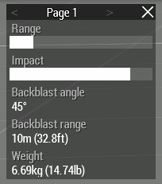
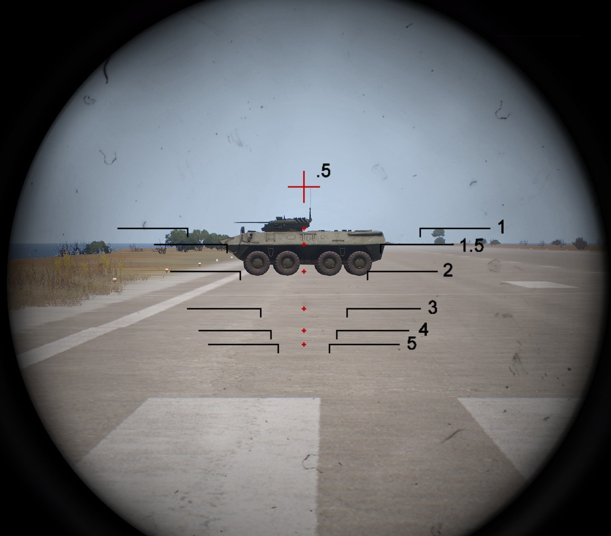

# Light Anti-Tank

## Role Description

An LAT rifleman is a semi-specialized operator class, and is not considered a standard operator. It can only be combined with the following specialized roles:

- Marksman
- Leadership

The primary role of the LAT rifleman is to eliminate light vehicle threats.

### Equipment

- RPG-32

## Usage

### Backblast

Every rocket has a blackblast zone behind the launcher. This area needs to be clear before discharging an LAT weapon. You can see the backblast angle and range in the ACE arsenal stats.

The area needs to be clear of any people or large obstructions. Do not fire the weapon while against a wall or other structure that will redirect the overpressured air back towards you.

### Callouts

When you begin to prepare the weapon you must make a callout of "Clear Backblast - [Direction]". The direction should be the direction the rocket will be moving toward. Hold until you hear "Clear Clear Clear" or "Backblast Clear". Once ready call "Rocket out" or "Rocket Rocket Rocket" then discharge the weapon. If you will not be discharging the weapon yell "Cancel Cancel Cancel".

These callouts will greatly reduce the chance of injury to either yourself, or your team members.

Examples

> *LAT*: Clear back - East  
> *Rifleman*: Clear Clear Clear  
> *LAT*: Rocket out

> *LAT*: Clear back - North West  
> *Rifleman*: Clear Clear Clear  
> *LAT*: Cancel Cancel Cancel, vehicle moved away

### Rocket Selection

The RPG-32 has two selections for rockets. The first selection is a High Explosive round. This round is ideal for soft targets, and unarmored vehicles, such as technicals. The second round is an HE round equipped with a penetrator. This round is useful against lightly armored threats, such as up-armored civilian vehicles, and can pose a threat against more heavily armored vehicles if hit in a lightly armored spot, or with enough rounds. 

Even though the RPG-32 has an Anti-Tank round, it SHOULD NOT be relied upon to deal with heavily armored threats, instead, a MAT or a HAT operator should be called in to neutralize the threat, depending on severity and availabilty of operators.

### RPG-32 Ranging Optic

The RPG-32 is equipped with an optic system designed to quickly estimate the range of the threat the operator is shooting at. Be advised that this system is designed for larger vehicles such as APC's and tanks, and will not provide accurate results against civilian vehicles such as trucks and jeeps.

To begin, equip your RPG, and acquire the target in the sight. To estimate range, see which ranging hash most closly fits the vehicle as shown below.

Vehicles may vary in size, so the ranging hashes may be slightly off, but this method should be reliable within acceptable limits.

When ranging technicals, the size of the vehicle is smaller than the threat the ranging hashes are designed for. As you can see below, the technical will fit within the 200 meter hashes, but the technical is only 150 meters away. If time permits while engaging these targets, best practice is to ask someone for a range to target before engaging.

## Certification

### Practical Exam

#### Equipment

- RPG-32

#### Practical Exam

- RPG-32

- Car   - 150m
- Truck - 200m
- Car   - 250m
- Car   - 350m
- Truck - 400m
