# Personal Electronics

## Certification Description

Acquiring the Personal Electronics certification will allow contractors to make use of the Vector 21 rangefinder and the MicroDAGR GPS.

### Equipment

- MicroDAGR GPS
- Vector 21 rangefinder

## MicroDAGR

The MicroDAGR is a military grade Geo-Positioning System (GPS) that provides the user with a wide array of data that will benefit their knowledge of position,navigation and timing (PNT).

The features of the MicroDAGR are:
- Compass and headings
- Date and hour synced to the mission
- Elevation (above or below sea level)
- Current speed
- GPS with topographic and satellite view
- Creating, naming, deleting waypoints
- Friendly identification (BLUFOR tracker needs to be on)
- The MicroDAGR is also able to connect to your vector to retrieve data from it

### Usage

1. Bringing up the MicroDAGR
    1. Self interact by holding Ctrl + Win.
    2. Select Equipment.
    3. Select configure MicroDAGR.

2. The MicroDAGR interface

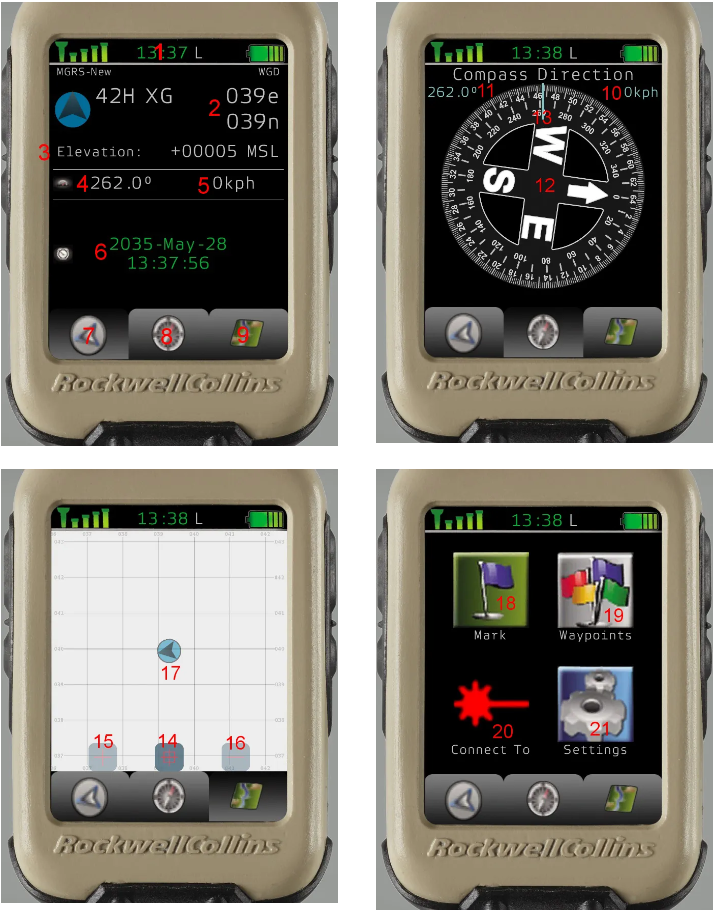

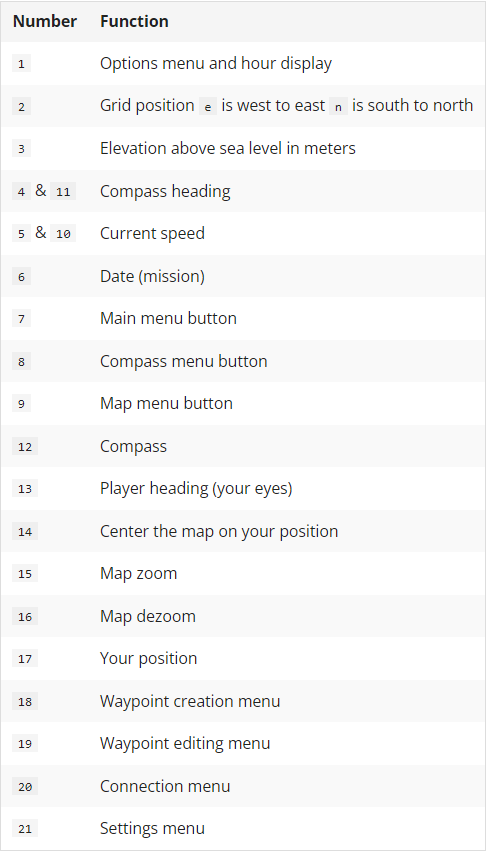

1. Waypoint usage
    1. Adding waypoints
    
        There are three different ways of adding a waypoint

        #### First way: Using the waypoint creation menu
            1. Find the position you want to mark on the map.
            2. Get it’s map grid.
            3. The grid is composed of 6 digits.
            4. The first three digits are read west to east. (Top of the map screen).
            5. The last three are read south to north. (Left side of the map screen).
            6. Go to the options menu (Click in 1 area, above the bar).
            7. Click on Mark(18).
            8. Enter the grid number.
            9. Press OK.
            10. Enter the desired name of the waypoint.
            11. Press OK.
        #### Second way: Using the waypoint menu
            12. Find the position you want to mark on the map.
            13. Get it’s map grid.
                2.1 The grid is composed of 6 digits.
                    2.1.1 The first three digits are read west to east. (Top of the map screen).
                    2.1.2 The last three are read south to north. (Left side of the map screen).
            3.Go to the options menu (Click in 1 area, above the bar).
            14. Click on Waypoints (19).
            15. Click on Add.
            16. Enter the grid number.
            17. Press OK.
            18. Enter the name of the waypoint.
            19. Press OK.

        #### Third way: Using the map menu
            20. Go to the map menu (click on 9)
            21. Double left click on the position where you want your waypoint.
            22. Enter the name of the waypoint.
            23. Press OK.

    2. Setting a waypoint
        1. Go to the options menu (Click in 1 area, above the bar).
        2. CLick on Waypoints (19).
        3. Select the waypoint.
        4. Click on SetWp.

        5. Once a waypoint is set:
            5.1 It’s heading, elevation and distance are marked on the main menu. (7)
            5.2 It’s heading, direction, grid position and name are marked in the compass menu (8)
            5.3 A marker appear at the waypoint grid location in the map menu (9)

    3. Deleting a waypoint
        1. Go to the options menu (Click in 1 area, above the bar).
        2. Click on Waypoints (19).
        3. Select the waypoint.
        4. Click on Delete.

2. Switching between mils and degrees
    1. Go to the options menu (Click in 1 area, above the bar).
    2. Click on Settings (21)
    3. Double left click on the unit next to Angular unit:

3. Switching between topographical and satellite view
    1. Go to the map menu (9)
    2. Click on the map menu button again (9)

4. Retrieving data from the Vector 21.
    1. For this you need a Vector 21.
    2. Go to the options menu (Click in 1 area, above the bar).
    3. Click on Connect to (20).
    4. Pull out your Vector 21.
        4.1 Press and hold both R and Tab ↹ until the red pointing circle appears.
        4.2 Sight the circle on the object and release both keys.
    5. The data on the main menu now has changed, you can now see the azimuth the range and the elevation of the point you sighted.
    6. Note that the compass menu also changed and now features the azimuth, compass bearing, distance and grid position of the point you sighted.

    Note that the results of the measure you took won’t change until you do an other measure.

## Vector 21 rangefinder

The Vector 21 is a rangefinder with a larger set of capabilities than other choices that are more readily available. It comes in two versions the Vector 21 being the regular version and the Vector 21 Nite which enables the person carrying it to make use of night vision capabilities.

The capabilities of the Vector 21 are:
- Distance to a target
- Azimuth to a target
- Horizontal and vertical distance to a target
- Distance between 2 targets
- Angle between 2 targets
- Switching the distance measurment unit between feet and meters
- Switching azimuth measurement unit between degrees and mils

### Usage

1. Slope distance
    
    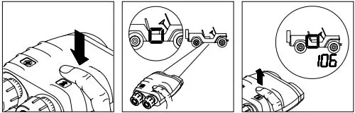
    - Press and hold R until the red pointing circle appears. Sight the circle on the object and release the key.
 
2. Azimuth

    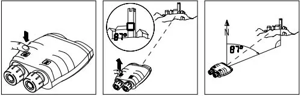
    - Press and hold the Tab ↹ until the azimuth is displayed.

3. Slope distance and Azimuth

    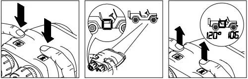
    - Press and hold both R and Tab ↹ until the red pointing circle appears.
    - Sight the circle on the object and release both keys.

4. Horizontal distance and height difference

    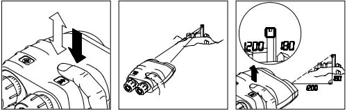
    - Tap R once then press and hold it until the red pointing circle appears.
    - Sight the circle on the object and release the key.

5. Azimuth and inclination

    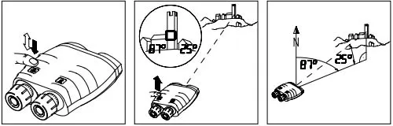
    - Tap Tab ↹ once then press and hold it until the azimuth and inclination is displayed.

6. Distance between two points

    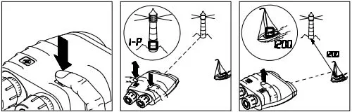
    - Press and hold R until the red pointing circle appears.
    - Sight the circle on the first object and tap Tab ↹ while further holding R. The first measurement is confirmed (“1-P” = first point).
    - Sight the second object and release R.

7. Horizontal and vertical distance between two points

    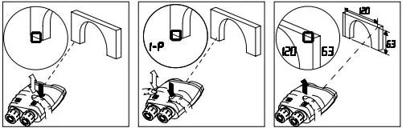
    - Tap R once then press and hold it until the red pointing circle appears.
    - Sight the circle on the object and tap Tab ↹ once. The first measurement is confirmed (“1-P” = first point).
    - Sight the second object and release R.

8. Horizontal distance and azimuth between two points

    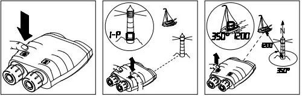
    - Press and hold Tab ↹ until the azimuth appears.
    - Sight the circle on the first object and tap R while further holding Tab ↹. The first measurement is confirmed (“1-P” = first point).
    - Sight the second object and release Tab ↹.

9.  Fall of shot

    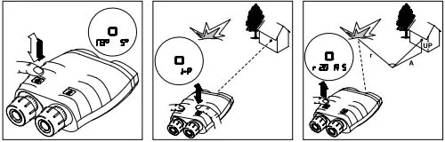
    - Tap Tab ↹ once then press and hold it until the azimuth appears.
    - Sight the circle on the object and tap R while further holding Tab ↹. The first measurement is confirmed (“1-P” = first point).
    - Sight the Fall of shot and release Tab ↹. The left digits display the left (L)/right (r) correction value in meter and the right digits display the longer (A = add)/shorter (d = drop) correction value in meter. If R is tapped the height correction values will be displayed (UP and dn).

10. Setting the measurement units (degrees/mils & meters/feet)
    - Tap Tab ↹ five times fast. “Unit SEtt” appears briefly.
    - Press R until the desired units are displayed.
    - Tap Tab ↹ five times fast to save the selection.

## Certification

### Requirements

- Junior Member

### Theoretical Exam

The trainee is able to answer random questions regarding the usage of both devices.

### Practical Exam

1. The trainee is able to navigate to a position provided by the instructor using the DAGR.
2. The trainee is able to navigate to a position provided by the instructor using the MicroDAGR.
3. The trainee is able to use the Vector 21 to provide information about structures designated by the instructor.
4. The trainee is able to provide information to a remote team about a structure designated by the instructor.
