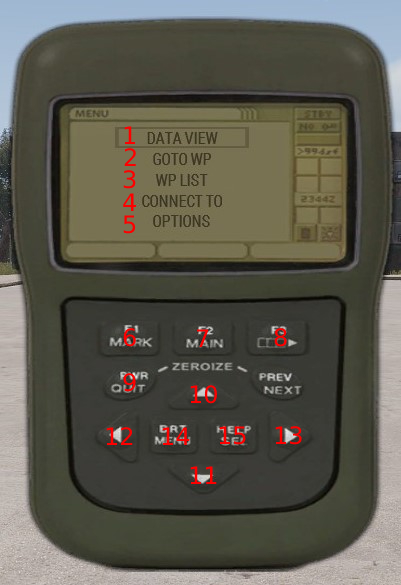
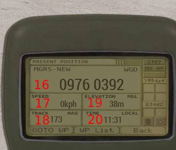

# Personal Electronics

## Certification Description

Acquiring the Personal Electronics certification will allow contractors to make use of the Vector 21 rangefinder and the MicroDAGR GPS.

### Equipment

- DAGR GPS
- Vector 21 rangefinder

## DAGR

The DAGR is a military grade Geo-Positioning System that provides the user with navigational data in order to help them traverse the enviornment.

The features of the DAGR are:

- Current coordinates
- Current speed
- Elevation (above or below sea level)
- Compass bearing
- Local time
- Creating, naming and deleting waypoints
- The DAGR is also able to connect to your vector to retrieve data from it.

### Usage

1. Bringing up the DAGR
    1. Self interact by holding Ctrl + Win.
    2. Select Equipment.
    3. Select configure DAGR.
    4. Press the Home key to bring it up in order to configure it.

2. The DAGR interface

    1. Data view
    2. Go to waypoint
    3. Waypoint list
    4. Connect to
    5. Options menu
    6. 7 & 8 Function buttons
    7. Power button
    8.  11 12 & 13 Navigation buttons
    9.  Menu button
    10. Select button
    11. Grid coordinates
    12. Current speed
    13. Compass bearing
    14. Current elevation
    15. Local time

3. Viewing data

    When you first pull out the DAGR it will automatically be in the data view mode. If you ever exit it and wish to set it again simply select the data view option in the menu.

4. Waypoint usage
   1. Adding a waypoint
      1. On the menu use the navigation buttons to select the waypoint list .
      2. Once there press the F1 button in order to add a waypoint.
      3. Using the navigation buttons input the desired coordinates.
      4. Press F1 to save the waypoint.

    2. Setting a waypoint
       1. On the menu use the navigation buttons to select Go to waypoint.
       2. With the navigation buttons select the waypoint you wish to go to.
       3. With that done you can now see on data view the coordinates and bearing of your waypoint along side your current ones and the distance to your target.

    3. Deleting a waypoint
       1. On the menu use the navigation buttons to select the waypoint list.
       2. Once there use the navigation buttons to select the waypoint you wish to delete.
       3. Press F3 to delete the waypoint.

5. Connecting to the Vector 21 rangefinder
   1. On the menu use the navigation buttons to select Connect to.
   2. Once there select the Vector 21 rangefinder.
   3. Once it is connected when you range something with the vector you will see the information displayed on your DAGR. Note that the information will change to your current one once you move.

6. Changing the signal delay
   1. On the menu use the navigation buttons to select Options.
   2. Once there select Signal Delay.
   3. Use the up and down button to increase and decrease the delay respectively.
   4. The lower the delay the faster the information on you GPS will update.

7. Changing the bearing unit from degrees to MILS
   1. On the menu use the navigation buttons to select Options.
   2. Once there select Directions:
   3. Change the unit to that which you desire.

    Note that the default unit is Degrees.

## Vector 21 Rangefinder

The Vector 21 is a rangefinder with a larger set of capabilities than other choices that are more readily available. It comes in two versions the Vector 21 being the regular version and the Vector 21 Nite which enables the person carrying it to make use of night vision capabilities.

The capabilities of the Vector 21 are:

- Distance to a target
- Azimuth to a target
- Horizontal and vertical distance to a target
- Distance between 2 targets
- Angle between 2 targets
- Switching the distance measurment unit between feet and meters
- Switching azimuth measurement unit between degrees and mils

### Usage

1. Slope distance
    
    
    - Press and hold R until the red pointing circle appears. Sight the circle on the object and release the key.
 
2. Azimuth

    
    - Press and hold the Tab ↹ until the azimuth is displayed.

3. Slope distance and Azimuth

    
    - Press and hold both R and Tab ↹ until the red pointing circle appears.
    - Sight the circle on the object and release both keys.

4. Horizontal distance and height difference

    
    - Tap R once then press and hold it until the red pointing circle appears.
    - Sight the circle on the object and release the key.

5. Azimuth and inclination

    
    - Tap Tab ↹ once then press and hold it until the azimuth and inclination is displayed.

6. Distance between two points

    
    - Press and hold R until the red pointing circle appears.
    - Sight the circle on the first object and tap Tab ↹ while further holding R. The first measurement is confirmed (“1-P” = first point).
    - Sight the second object and release R.

7. Horizontal and vertical distance between two points

    
    - Tap R once then press and hold it until the red pointing circle appears.
    - Sight the circle on the object and tap Tab ↹ once. The first measurement is confirmed (“1-P” = first point).
    - Sight the second object and release R.

8. Horizontal distance and azimuth between two points

    
    - Press and hold Tab ↹ until the azimuth appears.
    - Sight the circle on the first object and tap R while further holding Tab ↹. The first measurement is confirmed (“1-P” = first point).
    - Sight the second object and release Tab ↹.

9.  Fall of shot

    
    - Tap Tab ↹ once then press and hold it until the azimuth appears.
    - Sight the circle on the object and tap R while further holding Tab ↹. The first measurement is confirmed (“1-P” = first point).
    - Sight the Fall of shot and release Tab ↹. The left digits display the left (L)/right (r) correction value in meter and the right digits display the longer (A = add)/shorter (d = drop) correction value in meter. If R is tapped the height correction values will be displayed (UP and dn).

10. Setting the measurement units (degrees/mils & meters/feet)
    - Tap Tab ↹ five times fast. “Unit SEtt” appears briefly.
    - Press R until the desired units are displayed.
    - Tap Tab ↹ five times fast to save the selection.

## Certification

### Requirements

- Junior Member

### Theoretical Exam

The trainee is able to answer random questions regarding the usage of both devices.

### Practical Exam

1. The trainee is able to navigate to a position provided by the instructor using the DAGR.
2. The trainee is able to navigate to a position provided by the instructor using the MicroDAGR.
3. The trainee is able to use the Vector 21 to provide information about structures designated by the instructor.
4. The trainee is able to provide information to a remote team about a structure designated by the instructor.
