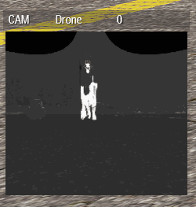
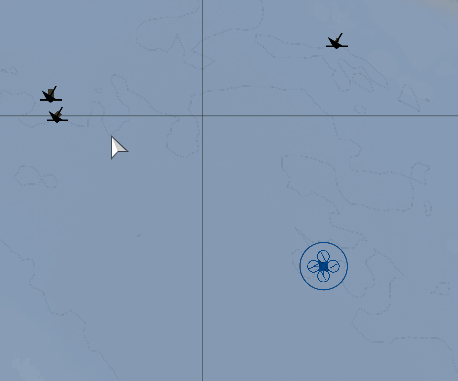
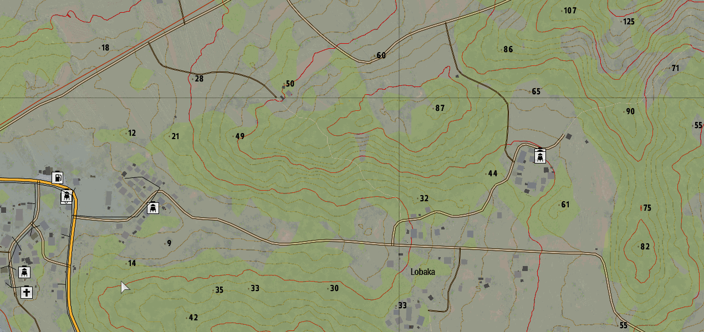
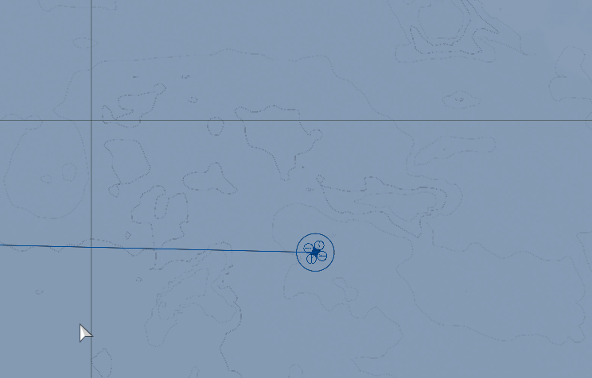
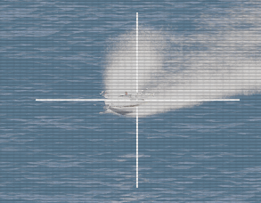

# UAV Operator

## Role Description

UAV Operators will be able to operate remote systems for the purpose of scouting and fire support.

!> Note: UAV Operators are required to have their PiP quality set to Ultra.

### Specialized Equipment

Completing the certification for UAV Operator will unlock the ability to purchase a UAV Terminal and UAV Batteries.

| Device              | Requirements             |
|---------------------|--------------------------|
| AR-2 Darter         |                          |
| UGV Stomper         | Driver                   |
| YABHON-R3 (Unarmed) | Fixed-Wing               |
| YABHON-R3 (Armed)   | Fixed-Wing + Air Weapons |
| MQ-9 Reaper         | Fixed-Wing + Air Weapons |
| MQ-12 Falcom        | Rotary + Air Weapons     |

## Usage

This guide will cover autonomous and manual operations of both air and land remote systems.

### Connecting

Approach the UAV/UGV and use the ACE interaction menu or action menu to connect the device to your terminal.

Once connected use the `[` or `]` key to monitor the UAV camera. `Right Control + [` or `Right Control + ]` can be used to change the optic mode.

Open the UAV Terminal using the action menu.

In the top left is the device selection window. Select a UAV from the drop down.  
The window will show:

| Metric | Description|
| -- | -- |
| STAT | Condition of the device |
| FUEL | Percentage of remaining fuel |
| WPN  | List of available weapons |
| POS  | GRIDREF of the UAV |
| AZT  | Azimuth, direction the device is facing |
| SPD  | Speed in KM/H |
| ALT  | Altitude in meters |

### Manual Operations

UAV Operators are expected to be able to fully operate any device they use via manual control.

Manual operations are vital when operating a damaged device, or to evade fire.

To manually control a device, select `CONTROL DRIVER` from the UAV Terminal or `Take UAV controls` from the action menu.

In normal conditions, this mode is not recommended for the AR-2 Darter and is only recommended during take-off / landing on other devices. Landing autopilot can be used is for rotary devices, but is not allowed to be used on fixed-wing devices due to it's inconsistency.

### Autonomous Operations

Autonomous operations will make up the majority of the time spent controlling remote devices.

#### Move Order

##### Position

`Shift + Left Click`  
The UAV will proceed to the marked location

##### Path

`Shift + Left Click`, then `Control + Shift + Left Click`  
The UAV will follow the indicated path.

##### Patrol

`Shift + Left Click`, then `Control + Shift + Left Click`  
The last waypoint needs to be of type `Cycle`  
The UAV will fly along the indicated path indefinitely.

##### Altitude

`Right Click -> Altitude`  
The UAV will fly to the assigned altitude

#### Waypoint Types

`Right Click -> Type`  
Changes the behavior of the UAV at the waypoint

##### MOVE

The device will move to this point or object. The move waypoint is considered complete when the device gets close to the waypoint, the required distance being between 1 and 500 meters depending on the device's vehicle type.

##### DESTROY

This waypoint type works best when it is attached to an object. The device will attempt to destroy whatever object the waypoint is placed upon. If the device is unable to destroy the attached object they will move within range of being able to identify the object, then wait until it is destroyed. If the waypoint is placed spatially, the waypoint's behaviour is less predictable. If the waypoint is far away from any mission editor placed objects, the waypoint will generally be instantly considered complete without the device moving towards the waypoint's location. If there is any object near the spatial waypoint, the device may treat that object as a normal destroy target. However, sometimes the device may start to attack the object, then instantly move to the next waypoint without destroying anything. The exact object the device will attack is not easily predicted, and if the device itself is near the spatial Destroy waypoint when it becomes active, the device may even choose to attack, but not necessarily destroy, one of its own members.

##### SEEK AND DESTROY

It does not matter if this waypoint type is placed spatially or on an object. If attached to an object, the waypoint will remain fixed at the objects initial position as displayed in the mission editor. Behaviour is the same for both situations - the device will move to the waypoint, then will move about to search the immediate area. The exact size of the area searched is limited to the device's expected travel time. A device on foot will rarely search more than 50m from the waypoint, while a device in the air will search up to 300m from the waypoint. The search will attempt to visually check all locations within the search range, so a search inside a city will take far longer than a search in an empty field. Whether or not the device finds any enemy units appears to have no impact on the search duration or range.

To make device hunt down a known target, you need to set the behavior to `Fire at will, engage at will`. The Seek & Destroy waypoint only makes the device search the vicinity of the waypoint itself, not affect their behavior on their way to the waypoint.

##### HOLD

This waypoint type will cause the device to move to and stay at this position indefinitely. While waiting, any unknown targets are checked and any recognized enemies are engaged if allowed.

##### SENTRY

The device will move to the waypoint and hold position until the device knows enough about an enemy unit to identify which side that it belongs to, and that it is capable of attacking. At that point, the device will proceed to its next waypoint. It will normally also attack the spotted enemy on the way if allowed.

##### GUARD

The device will follow and guard a predetermined object. Unused currently unless specified by the mission maker.

##### SUPPORT

Currently unused.

##### CYCLE

This waypoint type will change the device's active waypoint to the nearest waypoint other than the device's previous waypoint. A cycle type waypoint can be used to make the device move in an infinite loop, a great and easy way to create a patrol.

##### LOITER

The device will loiter around a position. If device is a ground vehicle then device will just stand around and the LOITER waypoint will act as a MOVE waypoint. If the device is an aircraft, it will orbit the waypoint's position with given height and loiter radius.

##### LAND

When added to a helicopter, it will land at a clear landing zone near the position of the waypoint, prioritizing existing helipads. When added to a fixed-wing device, it will land at the nearest runway and taxi quickly until they are in position to take off. For all aircraft, if the landing gear is destroyed, the device will not attempt to land and will instead move on to the next waypoint or circle the Land waypoint.

#### Behavior

##### NEVER FIRE

The device will never fire, even if under attack.

##### HOLD FIRE

The device will only fire if first fired upon.

##### OPEN FIRE

The device will engage confirmed hostile targets.

##### ENGAGE AT WILL

The device will leave it's waypoints to more effectively engage targets.

#### Tracking

The UAV camera can lock onto any object that emits heat, or follow a ground position.

##### Target Tracking

When the crosshair is on top of the target, press `Control + T` to begin tracking it.

##### Position Tracking

`Control + T` can also be used to fix the camera to a position. If the device moves the camera will remain looking at the same position.

## Certification

### Requirements

- Member

### Theoretical Exam

1. What is the primary responsibility of a UAV Operator?

2. What is the primary purpose of a UAV?

3. When is a UAV appropriate for a mission? 

### Practical Exam

1. The UAV Operator is able to identify all targets at an enemy position without being detected.

2. The UAV Operator is able to locate and lock onto a moving target.

3. The UAV Operator is able to provide updates of the tracked target while on the move.
