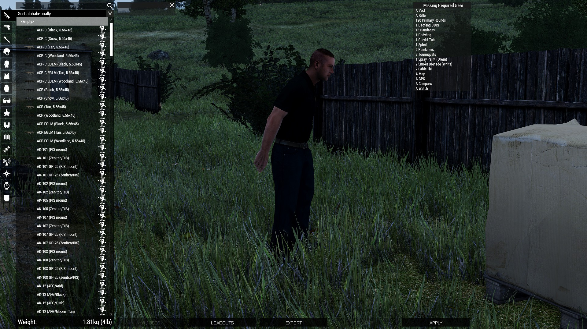
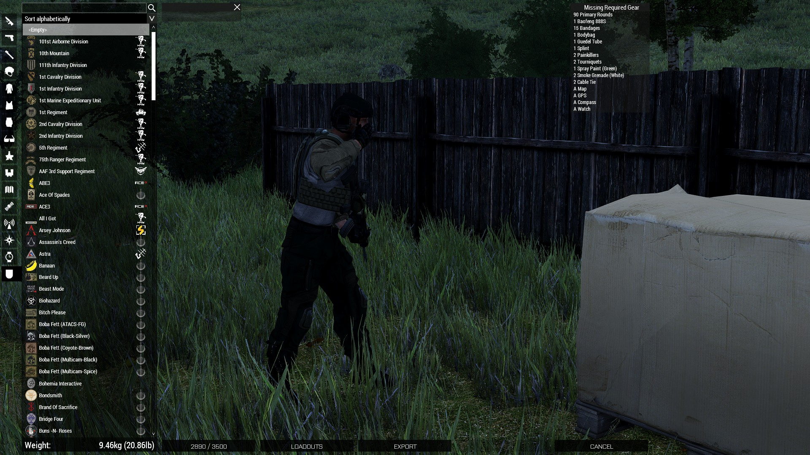
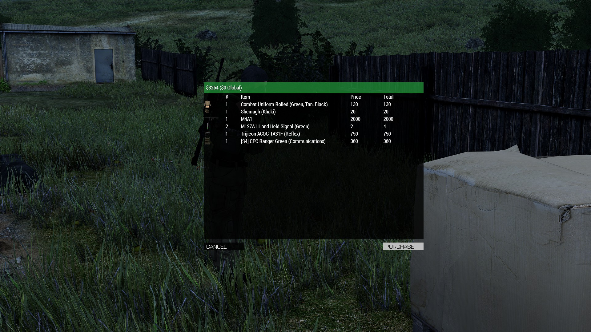
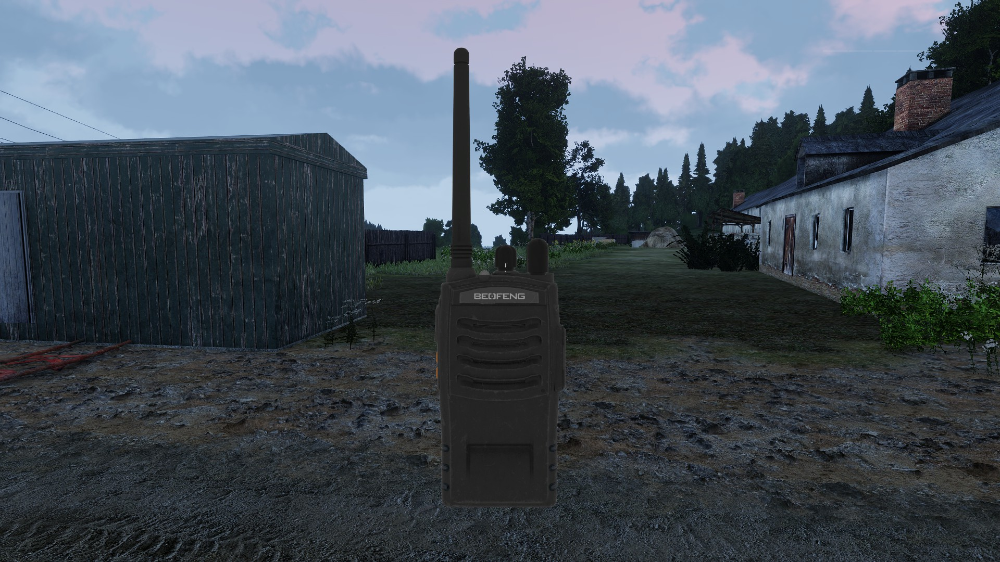
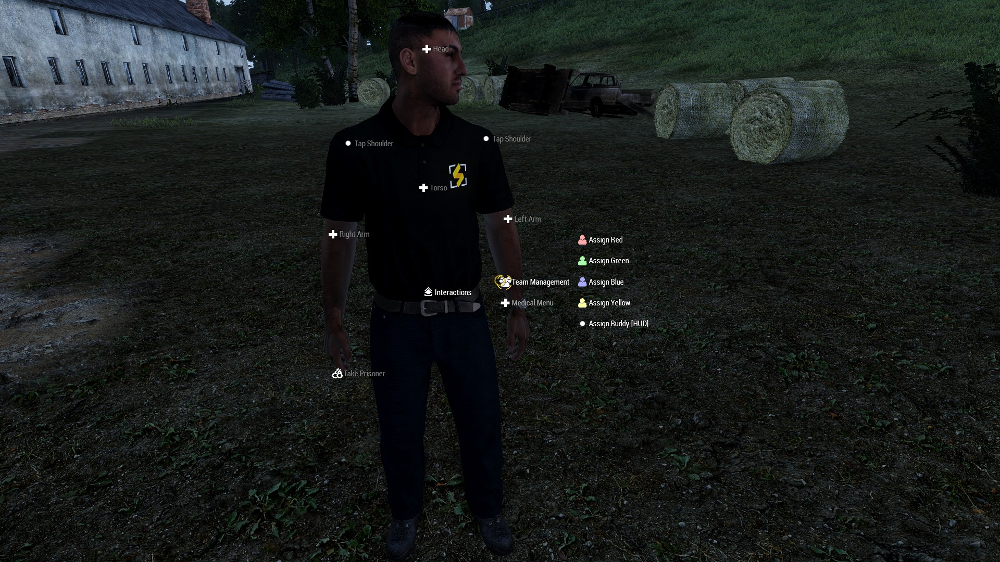

# Your First Operation

## Names

Before you jump into a game, you'll first need to set your Arma name to set your Synixe Contractors name. This is done using the profile menu or through Swifty by adding  `-name="Your Name Here"` to Swifty's parameters field. Your name should be in a First Last format.

## Shop

When you first load into our Contract Server you'll need to get your equipment from the Shop. You do this by using the ACE interact menu on the cardboard boxes with nets over them. Once inside the Shop, you'll notice the bottom left button is gray and shows "Balance 3500"

This button is used to show you your current cash balance. You start with 3500 and will earn more for successfully completing operations. As you go through and select gear, you'll notice the balance changes to not gray and now shows 0/3500. This is representative of the amount of money you are going to spend to buy gear.

You'll also notice a list labeled Missing Required Gear on the top right, this list contains every item a contractor is required to carry with him during operations and must always be blank when exiting the shop.

Once you are done click on the balance button on the lower left which will we be displaying the amount of money that you're goint to spend out of your total amount of money, should you be trying to spend more money than you have the button will be gray and you will be unable to interact with it. A new confirmation menu will pop up in the center. This screen will show you everything you are purchasing and give you the option to back out without purchasing.

Afterwards you will want to click apply in the bottom right to ensure the gear you are wearing gets put onto your character like the normal ACE Arsenal.

## Radio

When you get out of the arsenal, the first thing you'll want to do is setup your radio. Do that using `ACE Self Interact > Radios > Baofeng 888s > Open`  to pull up the radio. Then hover your mouse over the left dial at the top and left and right click to switch channels; when you switch channels you will hear a voice letting you know whcich channel you're on. You will put your radio onto whatever channel your element is supposed to be using for that operation as defined in your briefing. You can tweak the volume of your radio using the right dial at the top of the radio.

## Joining a Team

During the planning phase of the operation the Operation Lead will set up the contractors in different teams which are colour coded. You can check the map to see who your teammates are gonna be and what colour you team will be.

## Buddy

After you've got your team set, you'll need your battle buddy. Typically they will be the person who is paired with you in your team. (For example:  4 operators per team, 2 pairs of battle buddies per team), setting them as your buddy will help you keep track of them in game. You do this by `ACE Interact on Buddy > Interactions > Assign Buddy`.

