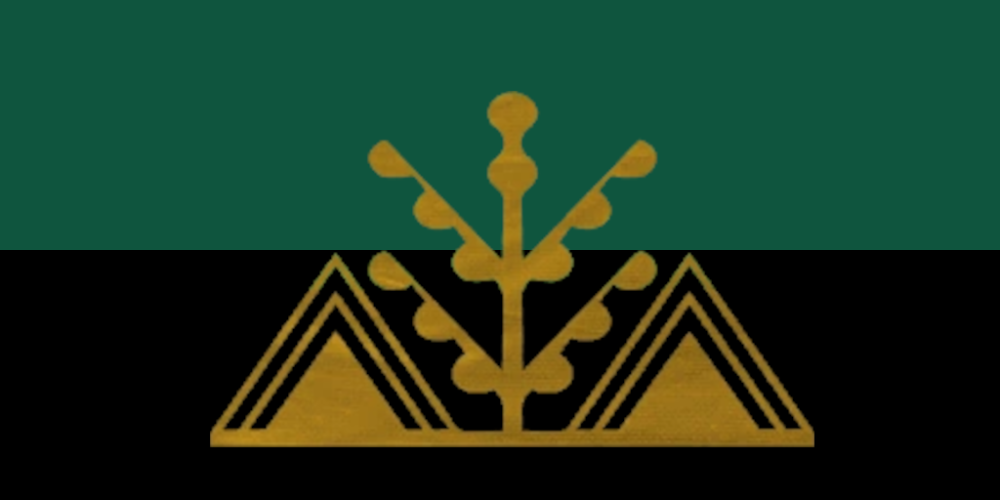
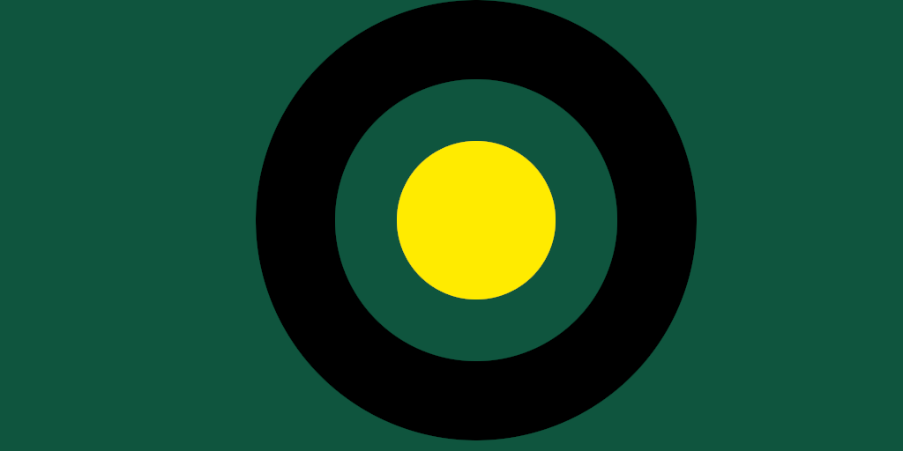
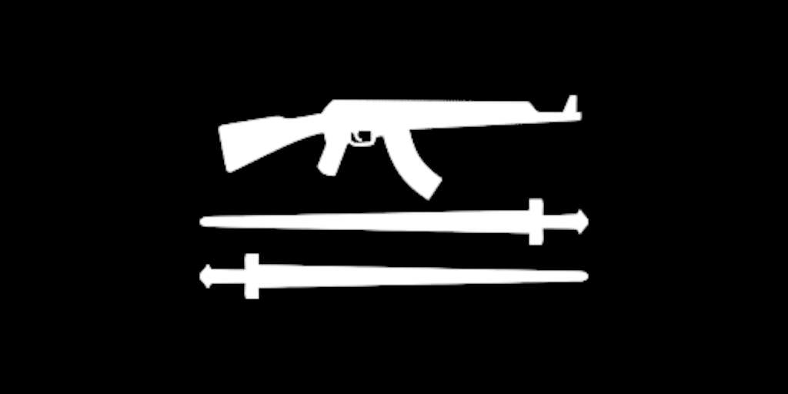

# Argana

## Overview

Argana is a post-colonial state, in its history known for state-organized piracy of the nearby seaborne trade routes. Within its current boarders lay 3 tribes united against the colonializers: Tura, Serfrawi and Imazighen. 

## Information

Primary Language: French  
Demonym: Arganan

## Military Equipment

Camoflage Pattern: Tan  
Platform: 6.5 Katiba/7.62mm AK  

## Civil war

50 years to the day after independence Tura rebellion named "Red Tiger Coup" launched the country into civil war. After years of internal strife with weak peace achieve, the miltia that fought alongside the government during the first civil war have refused orders. Sefrawi People's Liberation Army proclaimed from the state militia have once again thrown the country into the civil war. Dormant for years Tura have sprung another uprising into 3-way civil war.

The Arganan National Army caught unprepared during a modernization program, have ceded much of the territory economically important territory to the other factions.

### Sefrawi People's Liberation Army

Coming mainly from the big cities on the northern coast, much more cosmopolitan than the rest of the country. Unsatisfied with the sliding individual freedoms in the years post civil war they have seized the opportunity and moved onto the capital of Banjul.

### Tura Insurgency

Inheritors of the pre-colonial identity of the Berber region, the most traditional part of the society, crushed during the First Arganan Civil War, they have once again emerged and begun attacks across the historical region of Sefrou-Ramal
